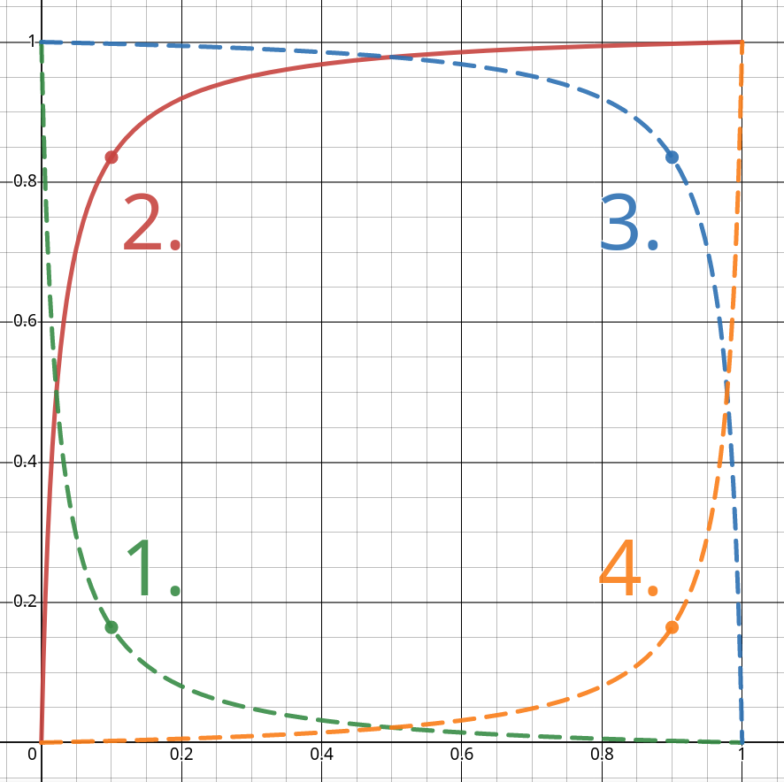

.. _knee_types_label:

Knee types
==========

There is a total of four (4) types of curves and corresponding knees.

   A graph showing 4 types of curves and their knees. All types are correctly recognized by knarrow and the correct knee will be returned in all cases. However, for ease of implementing all the methods, every input data is internally transformer to the type 2.

#. Type 1 (the green curve) - This is the **decreasing**, **convex** type. The values themselves are getting smaller and smaller, but the rate of the change of the values is increasing. [1]_
#. Type 2 (the red curve) - This is the **increasing**, **concave** type. The values themselves are getting bigger and bigger, but the rate of the change of the values is decreasing.
#. Type 3 (the blue curve) - This is the **decreasing**, **concave** type. Both the values themselves and the rate of change are getting smaller and smaller. [2]_
#. Type 3 (the yellow curve) - This is the **increasing**, **convex** type. Both the values themselves and the rate of change are getting bigger and bigger.

Internally, knarrow transforms all types to type 2 (the red, filled curve). This simplifies the implementation of the methods. The types are transformed as follows:

- Type 1 is transformed as :math:`(x, y) \rightarrow (x, 1-x)`
- Type 2 is transformed as :math:`(x, y) \rightarrow (x, y)` (trivial)
- Type 3 is transformed as :math:`(x, y) \rightarrow (1-x, y)`
- Type 4 is transformed as :math:`(x, y) \rightarrow (1-x, 1-y)`

.. [1] That’s because the derivative near zero has a large magnitude but a negative sign, and near one the derivative has a much smaller magnitude, yet the sign is still negative. Therefore, the derivative actually increased! This means the second derivative is positive.

.. [2] This means the values decrease faster and faster - exactly as the blue curve shows.
